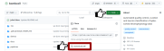
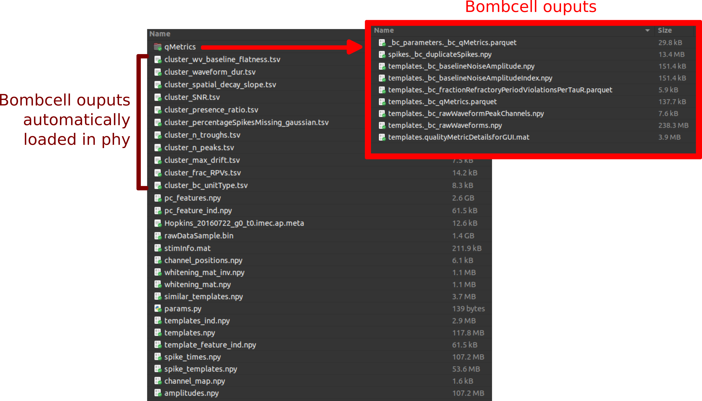
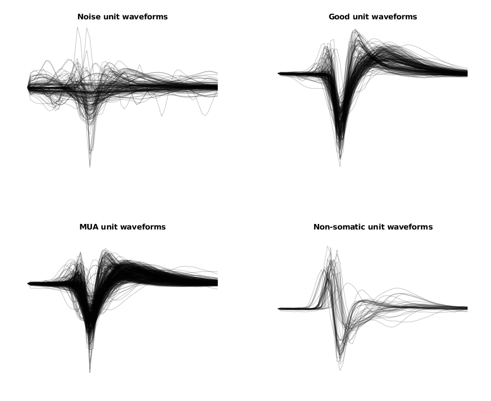
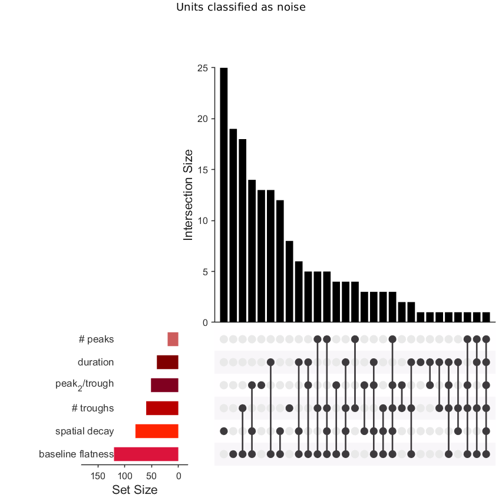
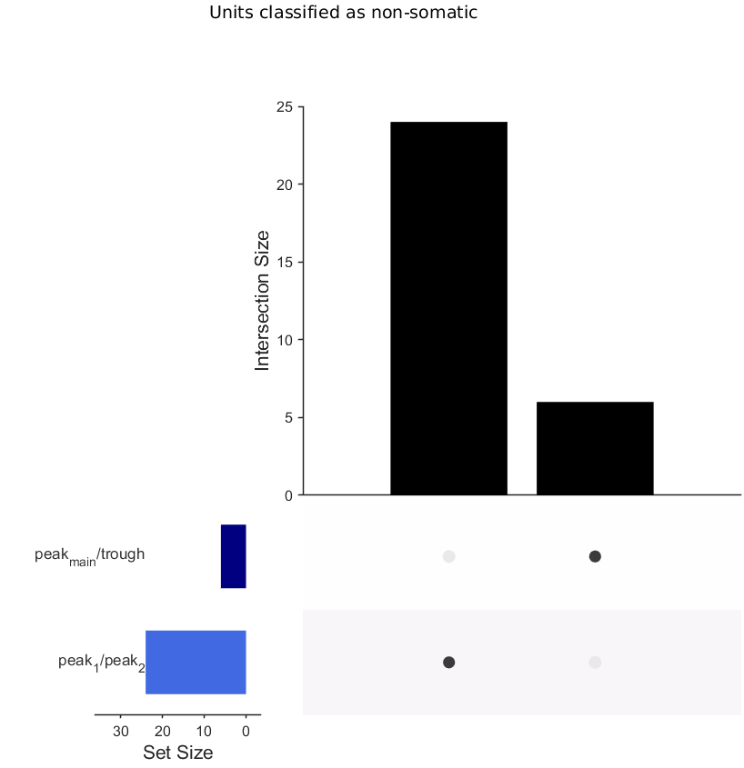
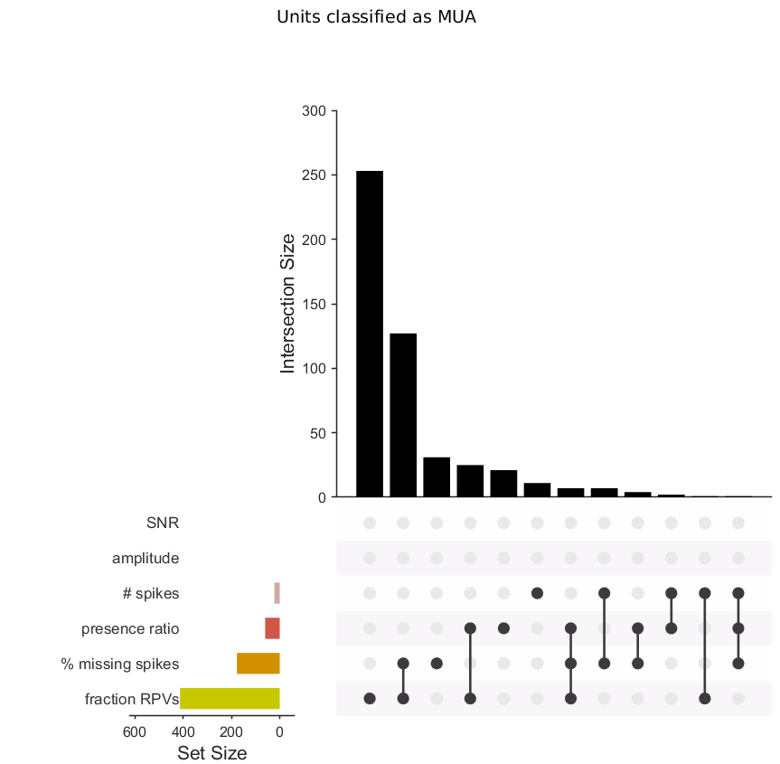
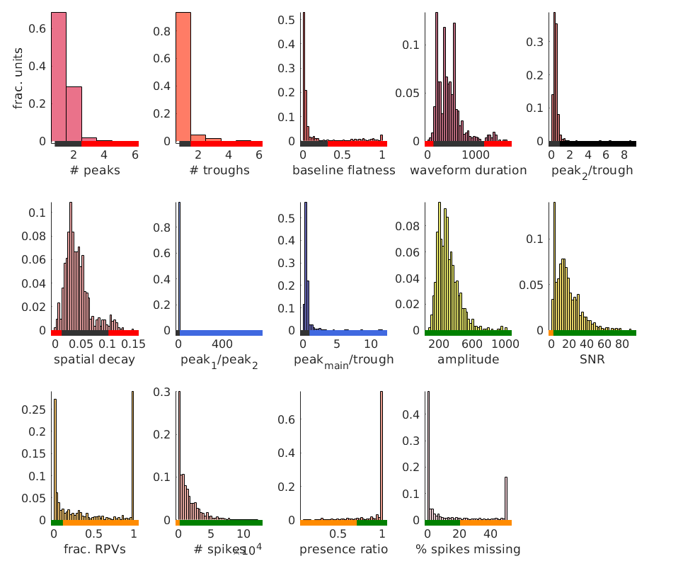
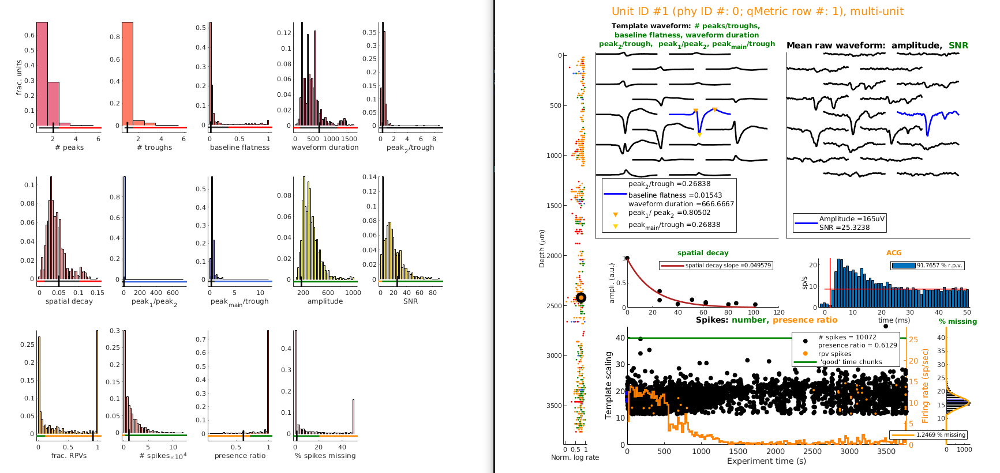

# Neuropixels course 2024 - quality control

This repository contains all resources and assignments for the quality control part of [UCL's 2024 Neuropixels Course](https://www.ucl.ac.uk/neuropixels/training/2024-neuropixels-course). If you run into any issues or have any questions, you can send a message on the #2_2-quality-control channel of the 2024 UCL Neuropixels Course slack or create a github issue here. 

We will go over a typical worksflow to assess unit quality using bombcell and phy. 

To help you navigate: 
```diff
+ Action items are displayed in green code blocks
```
```diff
- Questions are displayed in red code blocks
```
Happy quality control-ing! 

## Setting up 
We will use a freely available dataset generated by Nick Steinmetz that spans visual cortex, hippocampus, and some parts of thalamus in a mouse. This dataset was recorded on an early version of Neuropixels probes, and spike-sorted with an early version of Kilosort, but all these principles and methods are applicable accross Neuropixels probe types and Kilosort versions. 

### Download data
All the necessary data is located [here](https://rdr.ucl.ac.uk/articles/dataset/Recording_with_a_Neuropixels_probe/25232962/1). You will need to download the following files, and put them in one same folder : 

- amplitudes.npy
- channel_map.npy
- spike_templates.npy
- spike_times.npy
- template_feature_ind.npy
- templates.npy
- params.py
- pc_feature_ind.npy
- similar_templates.noy
- whitening_mat.npy
- whitening_mat_inv.npy
- channel_positions.npy
- stimInfo.mat
- pc_features.pny
- pc_features_ind.npy
- Hopkins_20160722_g0_t0.imec.ap.meta
- rawDataSample.bin

Make you sure you *do not* have the following files:     
- ~~spike_clusters.npy~~
- ~~- cluster_groups.csv~~

### Download and install bombcell
#### Requirements

For now, Bombcell is only available in MATLAB. If you don't have MATLAB, you can get a free 1-month license courtesy of Mathworks. See the slack for more details or email us: [julie.mfabre@gmail.com](mailto:julie.mfabre@gmail.com). 

If you don't wish to use MATLAB, you can wait for the Python version (coming soon!) and, for this exercise, use the pre-computed metrics and plots found in this repository. We will provide a few Python functions to load and inspect the metrics here :).

Bombcell requires MATLAB>=2019a and the following toolboxes: 
- Signal Processing Toolbox
- Image Processing Toolbox
- Statistics and Machine Learning Toolbox
- Parallel Computing Toolbox

#### To install: 

- clone the repository and the dependencies. You can do this either via git/GitHub desktop or directly by downloading the .zip file and decompressing it (see the image below)



- add bombcell's and the dependancies' folders to MATLAB's path. More details on how to do this [here](https://uk.mathworks.com/help/matlab/ref/pathtool.html). 

#### Dependencies
- [npy-matlab](https://github.com/kwikteam/npy-matlab), to load .npy data in.
- [prettify-matlab](https://github.com/Julie-Fabre/prettify_matlab), to make plots pretty.

### Download and install phy

Phy is a fast GUI to manually curate your data. Installation instructions can be found [here](https://github.com/cortex-lab/phy/) and documentation [here](https://phy.readthedocs.io/en/latest/)

## Run bombcell 
#### MATLAB users: 

```diff
+ 1. Open the [`gettingStarted_NPXcourse.mlx`](gettingStarted_NPXcourse.mlx) file in MATLAB. 

+ 2. Edit line 1, changing the location to where you have saved the example dataset you downloaded - for instance if you saved your dataset in `Neuropixels_course_2024_dataset` folder in your `Downloads` folder: 

toy_dataset_location = 'C:\Users\Poppy\Downloads\Neuropixels_course_2024_dataset'

+ 3. Run the sections 1-3 (Set paths, Load data & Run quality metrics)
```

#### Python users: 
coming soon! 

## Inspect and refine results 
### Outputs 
When you have run everything, Bombcell will have saved several files locally, and in particular:
- a series of cluster_xxxx.tsv that contain each unit's quality metric xxxx. These files are automatically loaded in phy and the unit IDs are in the phy format here (0-indexed).
- in the `qMetrics` folder:
    - a parquet file containing quality metrics for each unit and quality metric: templates._bc_qMetrics.parquet
    - a parquet file containing parameters for each quality metric: _bc_parameters._bc_qMetrics.parquet
    - npy files containing mean raw extracted waveforms and their peak channels: templates._bc_rawWaveform.npy and templates._bc_rawWaveformPeakChannels.npy
    - a npy file indicated which spikes were detected as duplicates by bombcell: spikes._bc_duplicateSpikes.npy
    


```diff
+ Run [section 4 (Examples - accessing bombcell's metrics)] to understand how the data is saved and how it can be used. 
```

### Setting thresholds, checking bomcbell performance and refining

#### Look at bombcell's output plots!
Bombcell will output 3 types of plots that can help you get a very quick idea of how well it is performing and if any of the thresholds need to be tweaked.  

1. Waveform overview 
The plot will look something like the one below and allows you to quickly see whether the algorithm is classifying noise and non-somatic units correctly. 


```diff
- Do the waveforms look well classified (are noise units, noisy, ect.)? 
```

2. UpSet plots 
These plots show the intersections and relationships between multiple sets of data, displaying both the size and composition of these intersections in a compact and easily interpretable format. Bombcell generates 3: one for units classified as noise, one for units classified as non-somatic and one for units classified as MUA. Looking at them will give you an idea of how well bombcell is performing.

```diff
+ Inspect the plots
```

```diff
- Are there any metrics that remove too many (i.e. the majority) of units?
- Are there any metrics that remove no units?
```

|  | | |
|-----|-------|-----|
|  |   |   |

3. Histograms of the distributions for each quality metric
The lines at the bottom indicate how the untis are classified based on the metric: red for noise, blue for non-somatic, green for good and orange for MUA. 


#### Look at bombcell's GUI 

```diff
+ Run [Section 5: Inspect] to bring up bombcell's GUI. This lets you visualize your units and how they were classified by bombcell.
+ flip through a few units using your keyboard to navigate:
+         left/right arrow: toggle between units 
+         g : go to next good unit 
+         m : go to next multi-unit 
+         n : go to next noise unit
+         a : go to next non-somatic unit ('a' is for aonxal)
+         up/down arrow: toggle between time chunks in the raw data
+         u: brings up a input dialog to enter the unit you want to go to
```


```diff
- Are there any units that are missclassified with the spatial decay metric? Can it be resolved by tweaking some parameter? 
```
#### Look at and refine the outputs in phy

Once bombcell is run, its outputs are also automatically loaded in phy.
Load up phy and take a look at all the columns you have in ClusterView - they correspond to bombcell's quality metrics. 

```diff
- Sort units by the 'spatial decay' parameter: could you tweak it? 
- In the good units, are there any you should split or merge? 
```

